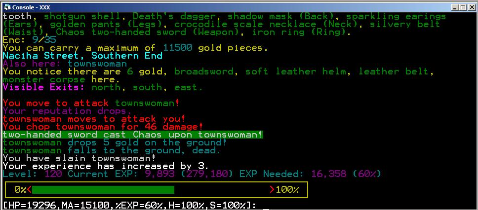



## Depths Of Despair Multi User MUD, Text Based Game, Massive Project

### Description

Depths Of Despair MUD (multiuser text based game) Stand-alone server.

Check out Description.txt in the download for a better look of this.

This game is not complete, but is massive. I think i have given up

working on it, seeing as i havn't touched it for awhile now. I would

guess that is is about 80-90% complete, maybe even more.

Game features include: movement, items, spells, weapons, monsters, quest,

combat, time system, money system, rooms can have doors, emotions, evil

system, familiars, private user guilds, hunger/stamina system, ability

to write notes in game and leave for other players, ability to form travel

party with players, projecttile weapons (guns/bows and arrows), shop's are

set up, players can sneak and backstab for more damage, theiving system,

train and level up and adjust stats how you want, Custom scripting launguage

to add many more custom commands, monsters roam the realm, plus many more

im sure i've forgotton.

This game is about 30,900 lines of code. Lots to look through. I've included

all the documents i've compiled as i've created this. It could help decode

how things work.

The database for the game is bassed in Access, so im not sure if it will work

if you don't have it. It can accept telnet connections from most any client.

It sends out the text with ANSI codes for color, so a client with color would

be the best. XP telnet works great.

I have also included a telnet client i was working on. It isn't complete or

perfect, but it works pretty decent. But it is just a barebones applicaiton.

The games purpose was to be a completely editable MUD, so things can be changed

drastically. I have included an editor (and this also isn't copmlete...), but its

about 90% complete with some bugs in it. It can also explain how lots of things work.

There is tons more inside this project, but i would have to write so much, it would

be better to just check it out.

Feel free to use this code or whatever, just don't make any profit from it, unless

you include me. And keep my name attached to what you take. I don't claim to have

wrote every line, but i was say a good 95% is mine.
 
### More Info
 

             |
---                |---
**Submitted On**   |2006-07-04 20:10:26
**By**             |[Chris VanHooser](https://github.com/Planet-Source-Code/PSCIndex/blob/master/ByAuthor/chris-vanhooser.md)
**Level**          |Advanced
**User Rating**    |5.0 (15 globes from 3 users)
**Compatibility**  |VB 6\.0
**Category**       |[Games](https://github.com/Planet-Source-Code/PSCIndex/blob/master/ByCategory/games__1-38.md)
**World**          |[Visual Basic](https://github.com/Planet-Source-Code/PSCIndex/blob/master/ByWorld/visual-basic.md)
**Archive File**   |[Depths\_Of\_200441742006\.zip](https://github.com/Planet-Source-Code/chris-vanhooser-depths-of-despair-multi-user-mud-text-based-game-massive-project__1-65872/archive/master.zip)

